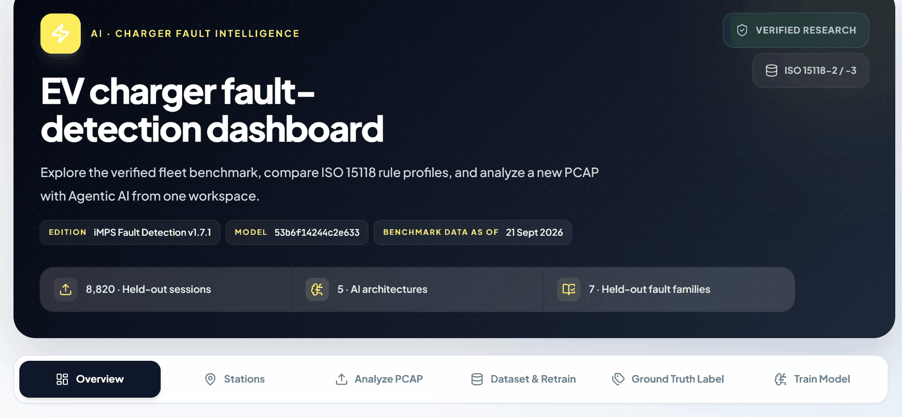
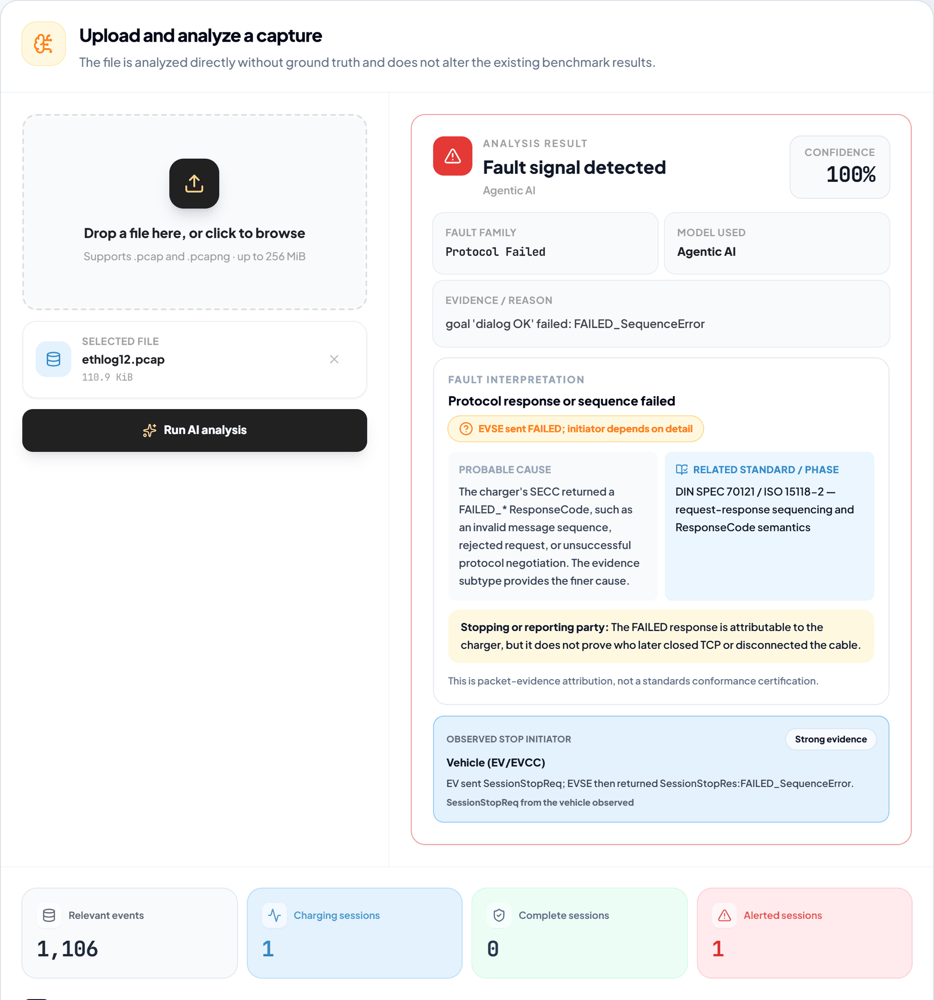
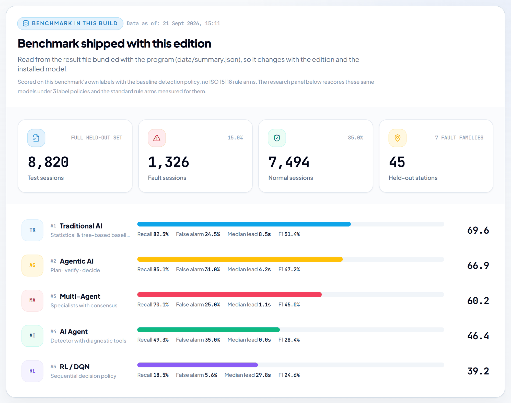
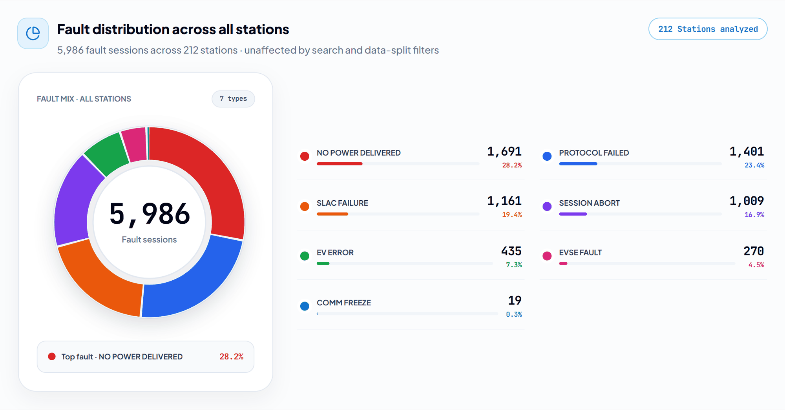
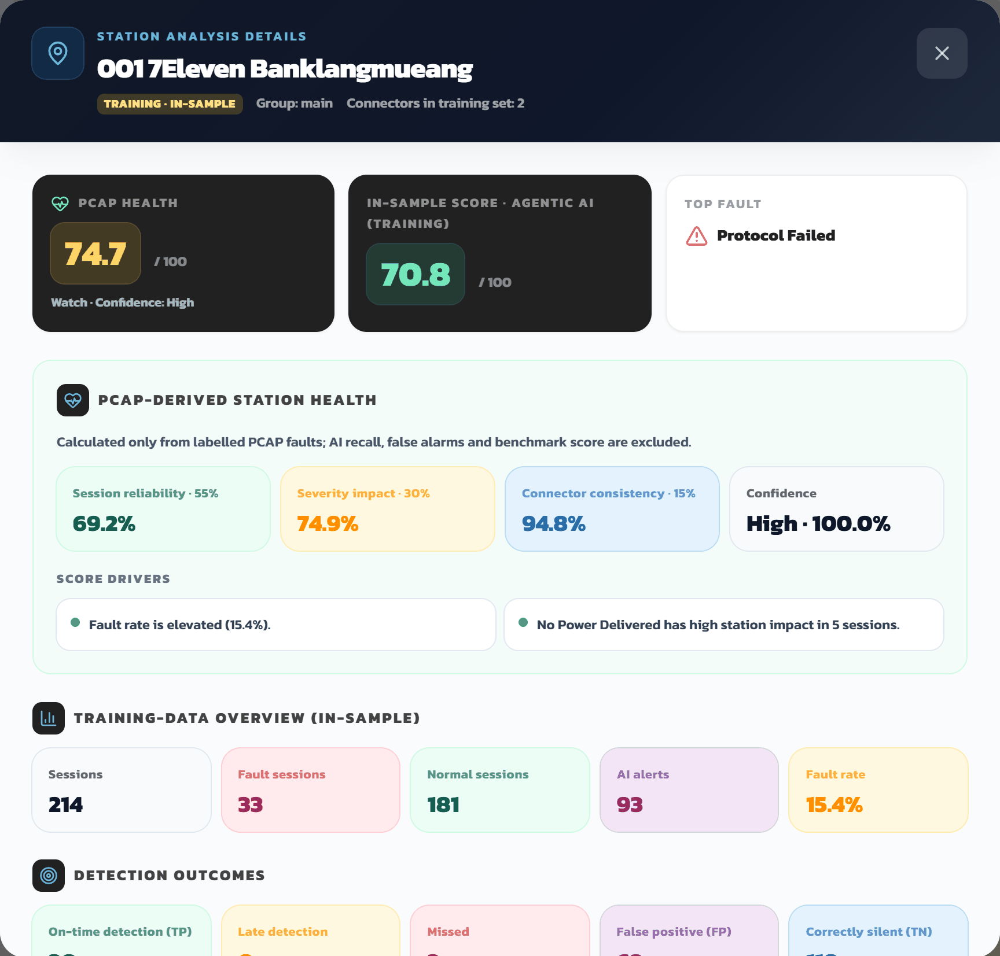
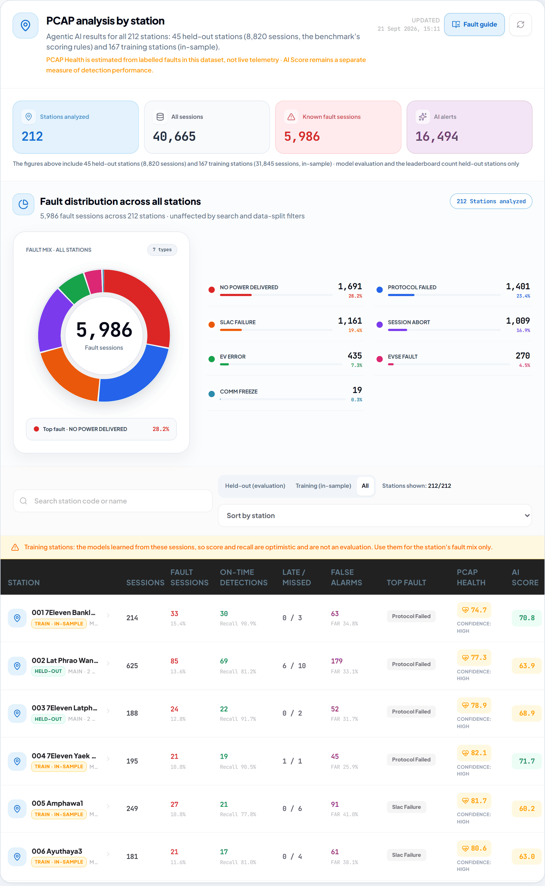
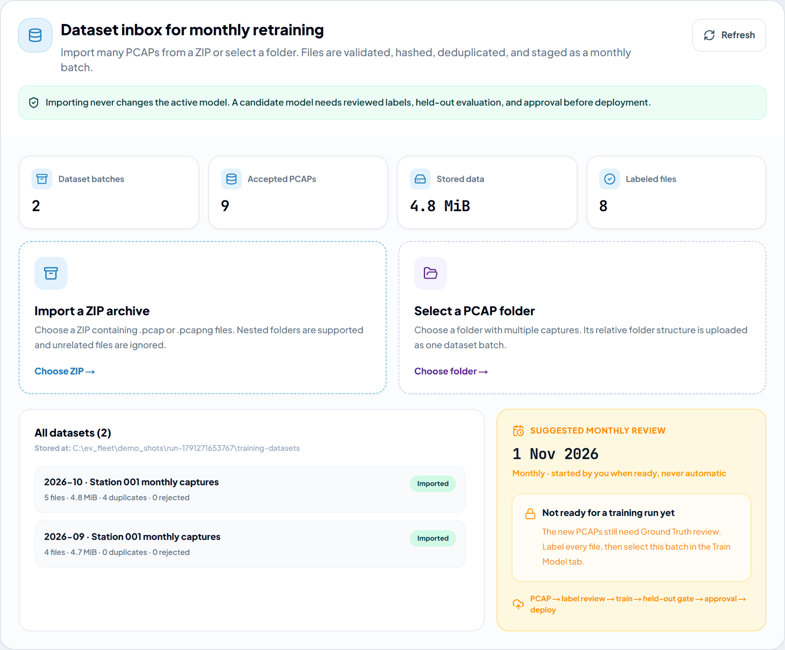
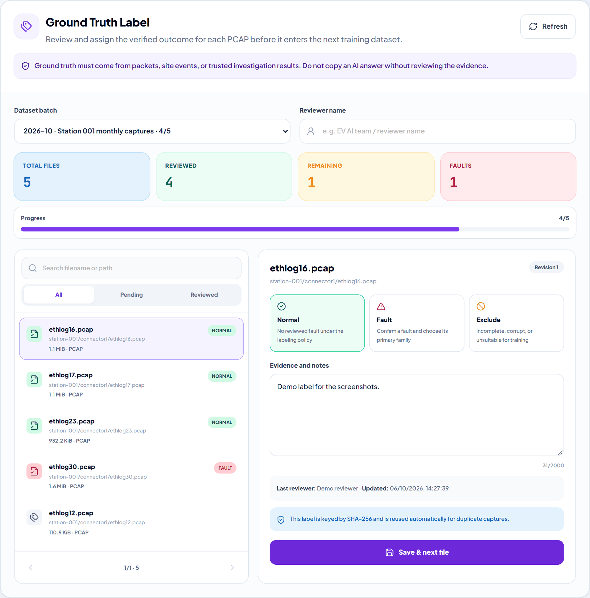
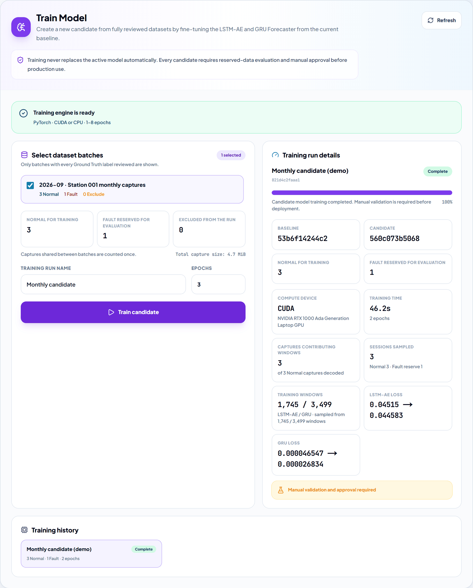

# EV Charger Fault Detection AI

**Analyze a DC charger capture offline on a Windows PC.** Open a `.pcap` of a charging session (DIN 70121 / ISO 15118-2) in **iMPS Fault Detection** and get the verdict, the fault family, the packet evidence behind it and who stopped the session. Wireshark is bundled, so there is nothing to set up, and the analysis runs without an internet connection.

[][latest]
[][latest]
[][releases]
[](LICENSE)


<p align="center">
  
</p>

**[Download the latest installer for Windows x64][latest]** (Offline about 231 MB, Online about 0.7 MB) · [Quick start](#quick-start-windows-x64) · [ภาษาไทย](#ภาษาไทย)

- **Everything in one installer.** Wireshark/TShark 4.4.6 with the dsV2Gshark 1.5.1 dissector, the Python runtime and the models are bundled. The Offline installer works without internet.
- **Shows its evidence.** Each detected fault names the packet-level reason, the probable cause, the related standard and protocol phase, and which side ended the session.
- **Built and benchmarked on a real fleet.** The detectors come from the EGAT charging fleet: **212 stations, 40,542 charging sessions, 44,198 captures**. Five detector architectures were trained and scored on the same held-out split: 8,820 sessions from 45 stations the models never saw.
- **Fleet view and monthly retraining.** The Stations tab scores each of the 212 stations in the bundled EGAT data set, and three optional tabs run a monthly retraining cycle that a person reviews and approves.

[Quick start](#quick-start-windows-x64) · [What the result tells you](#what-the-result-tells-you) · [Tour](#a-quick-tour) · [Editions](#editions) · [Report a problem](#report-a-problem--แจ้งปัญหา) · [Research](#for-researchers-and-developers) · [License](#license)

## Quick start (Windows x64)

| Installer | Size | What it does |
|---|---:|---|
| `iMPS-Fault-Detection-Offline-Setup-<version>.exe` | about 231 MB | installs everything and works without internet |
| `iMPS-Fault-Detection-Online-Setup-<version>.exe` | about 0.7 MB | downloads the same app from the release over HTTPS and checks its hash before installing |

1. **Download** one installer from the **[latest release][latest]**. The installers of the other [editions](#editions) carry the edition's name, for example `iMPS-Fault-Detection-ISO-15118-Offline-Setup-<version>.exe`.
2. **Install.** The installers are signed with an **internal self-signed certificate**, so Windows SmartScreen shows a warning. Choose *More info → Run anyway*. The first start after installing can take a few minutes while antivirus software scans the new files.
3. **Analyze.** Open **iMPS Fault Detection** from the Desktop or Start menu and select **Analyze PCAP** (วิเคราะห์ PCAP). Drop in a `.pcap` or `.pcapng` capture of a DC charging session (up to 256 MiB) and press **Run AI analysis**.

There is nothing else to install. The target PC needs no Node.js, Python, Conda, PyTorch, Wireshark, Npcap or MongoDB. The one exception is the optional Train Model tab, described [below](#monthly-retraining-optional).

<details>
<summary>About the self-signed certificate</summary>

The installers, the uninstaller, the app executable, `elevate.exe` and the Python sidecar `imps-fault-runtime.exe` are Authenticode-signed (SHA-256, DigiCert RFC 3161 timestamp) with an internal self-signed certificate: `CN=iMPS Fault Detection (EGAT internal, self-signed)`, thumbprint `74C4795C67E81EFCCFFAAB2B946661F1003C7A3E`, valid to 2031-09-22. Its public part is attached to every release as `iMPS-Fault-Detection-internal-codesign.cer` and is also kept in `imps_platform/desktop/signing/`.

A machine that imports it into *Trusted Root* and *Trusted Publishers* verifies the signature as valid. For the current Windows user (no administrator rights needed), run this in the folder that holds the `.cer`:

```powershell
certutil -user -addstore -f Root .\iMPS-Fault-Detection-internal-codesign.cer
certutil -user -addstore -f TrustedPublisher .\iMPS-Fault-Detection-internal-codesign.cer
```

On any other machine Windows SmartScreen still shows *More info → Run anyway*, because the certificate is not CA-issued. The bundled Wireshark/TShark binaries keep their Wireshark Foundation signature. All-users and Group Policy installation are described in [`imps_platform/desktop/signing/README.md`](imps_platform/desktop/signing/README.md).

</details>

## ภาษาไทย

**iMPS Fault Detection** เป็นโปรแกรมบน Windows สำหรับวิเคราะห์ไฟล์ PCAP ของการชาร์จแบบ DC (DIN 70121 / ISO 15118-2) ประมวลผลบนเครื่องทั้งหมด ไม่ต้องต่ออินเทอร์เน็ต และไม่ต้องติดตั้ง Wireshark หรือ Python เพิ่ม

1. ดาวน์โหลดตัวติดตั้งจาก [Release ล่าสุด][latest]: `Offline-Setup` (ประมาณ 231 MB ติดตั้งและใช้งานได้โดยไม่ต้องต่ออินเทอร์เน็ต) หรือ `Online-Setup` (ประมาณ 0.7 MB ดาวน์โหลดโปรแกรมเดียวกันระหว่างติดตั้ง)
2. ติดตั้ง ตัวติดตั้งลงนามด้วยใบรับรองภายในแบบ self-signed ดังนั้น Windows SmartScreen จะแจ้งเตือน ให้กด *More info → Run anyway* การเปิดโปรแกรมครั้งแรกหลังติดตั้งอาจใช้เวลาสองสามนาทีระหว่างที่โปรแกรมป้องกันไวรัสตรวจไฟล์ใหม่
3. เปิดโปรแกรม เลือก **วิเคราะห์ PCAP** แล้วเลือกไฟล์ `.pcap` หรือ `.pcapng` (ไม่เกิน 256 MiB) โปรแกรมจะแสดงผลการตรวจ กลุ่มความผิดปกติ (fault family) หลักฐานจากแพ็กเก็ต และฝ่ายที่หยุดการชาร์จ (รถหรือเครื่องชาร์จ)

ในรุ่นปัจจุบัน แท็บ ผลรายสถานี (Stations) แสดงผลและคะแนนสุขภาพ (PCAP Health) ของ 212 สถานีจากชุดข้อมูลของ กฟผ. ที่มากับโปรแกรม ไม่ใช่ข้อมูลสดจากเครื่องชาร์จ และไม่ได้คำนวณจากไฟล์ที่คุณนำมาวิเคราะห์

แจ้งปัญหาหรือขอฟีเจอร์ได้ทั้งภาษาไทยและภาษาอังกฤษ ([Bug report][bug] · [Feature request][feature]) **ห้ามแนบไฟล์ capture หรือ log ที่มีข้อมูลระบุตัวรถ (EVCCID, MAC address) ชื่อสถานี หรือตำแหน่งที่ตั้ง ใน issue สาธารณะ** ให้อธิบายลักษณะของไฟล์แทน หรือขอช่องทางส่งแบบส่วนตัวใน issue

## What the result tells you

<table>
<tr>
<td></td>
<td>

**Verdict and confidence.** *Fault signal detected*, *No fault alert in the observed evidence* or *Evidence is inconclusive*; a detected fault comes with the detector's confidence. The analysis is run by **Agentic AI** ([why](#under-the-hood)).

**Fault family.** The family the session falls into, for example *Protocol Failed*.

**Evidence / reason.** The packet-level reason, for example `goal 'dialog OK' failed: FAILED_SequenceError`.

**Fault interpretation.** The probable cause in plain words and the related standard and phase, for example DIN SPEC 70121 / ISO 15118-2 request-response sequencing and ResponseCode semantics.

**Who stopped the session.** The observed stop initiator, for example *Vehicle (EV/EVCC)*, with the strength of its evidence. It is kept apart from the party that reported the failure.

**Session details.** Totals for relevant events, charging sessions, complete sessions and alerted sessions, and one row per session with its events, duration, dialog status, AI alert, stop initiator and evidence. Notes flag problems such as a session with no observed SessionStop handshake, which may be truncated.

</td>
</tr>
</table>

The result is packet-evidence attribution, not a standards-conformance certification. The analysis runs on your PC and never changes the benchmark bundled with the app. The uploaded capture and its extracted telemetry are deleted when the job finishes or fails; a small result record is kept for traceability and expires after 30 days.

## A quick tour

The Overview and Stations tabs show the data set bundled with your edition: the EGAT fleet's benchmark and per-station results. They are not live telemetry, and the captures you analyze do not feed them. The screenshots show the English interface of the current line.

### Benchmark and fleet fault mix

<table>
<tr>
<td></td>
<td></td>
</tr>
<tr>
<td>

**Overview · 45 held-out stations**<br>The benchmark shipped with your edition, read from the result file bundled with the build. The five detectors are ranked by score, with recall, false-alarm rate, median lead time and F1.

</td>
<td>

**Stations · all 212 stations**<br>Every labelled fault session in the bundled fleet data, 5,986 in all, grouped by fault family.

</td>
</tr>
</table>

**Current line, benchmark v4** (data as of 21 Sep 2026): 8,820 held-out sessions (1,326 fault / 7,494 normal) at 45 stations the models never saw.

| # | Detector | Score | Recall | False-alarm rate | Median lead | F1 |
|---:|---|---:|---:|---:|---:|---:|
| 1 | Traditional AI | **69.6** | 82.5% | 24.5% | 8.5 s | 51.4% |
| 2 | Agentic AI (runs the PCAP analysis) | 66.9 | **85.1%** | 31.0% | 4.2 s | 47.2% |
| 3 | Multi-Agent | 60.2 | 70.1% | 25.0% | 1.1 s | 45.0% |
| 4 | AI Agent | 46.4 | 49.3% | 35.0% | 0.0 s | 28.4% |
| 5 | RL / DQN | 39.2 | 18.5% | 5.6% | 29.8 s | 24.6% |

Score = 50·recall + 30·(1−FAR) + 20·earliness ([how it is scored](#detectors-and-scoring)). The ISO 15118 edition runs the same weights with the standard's rule layers; see [its results](#benchmark-v4-and-the-iso-15118-edition).

**Fault mix, all 212 stations:** No Power Delivered 1,691 (28.2%) · Protocol Failed 1,401 (23.4%) · SLAC Failure 1,161 (19.4%) · Session Abort 1,009 (16.9%) · EV Error 435 (7.3%) · EVSE Fault 270 (4.5%) · Comm Freeze 19 (0.3%).

**Stations tab.** It lists all 212 stations with their sessions, fault sessions, on-time and late or missed detections, false alarms, top fault, PCAP Health and AI score. You can search by station code or name and filter held-out or training stations. The 45 held-out stations (8,820 sessions) come from the benchmark. The 167 training stations (31,845 sessions) are marked *in-sample*: the models learned from them, so their score (65.9) and recall (83.8%) are optimistic and are not part of the benchmark.

<sub>The two groups add up to the 40,665 sessions of the v4 data set behind the current line. The 40,542 sessions and 44,198 captures quoted at the top come from the full-fleet pipeline run completed on 12 Sep 2026.</sub>

### Station Health

<p align="center">
  
</p>

- **PCAP Health (0–100)** is calculated only from a station's labelled PCAP sessions in the bundled data set. AI recall, false alarms and the benchmark score are left out, so model quality cannot inflate asset health. The AI score stays visible next to it as a separate metric.
- The score combines **session reliability (55%)**, **severity impact (30%)** and **connector consistency (15%)**. It comes with a confidence level and score drivers written as plain sentences, such as *Fault rate is elevated*.
- Charger safety faults (`EVSE_FAULT`, `ISOLATION_FAULT`) weigh the most. A connector needs at least 20 sessions before it can be named as the station's hotspot.
- You can sort the station list with the lowest health first.

<details>
<summary>The full Stations tab</summary>

<p align="center">
  
</p>

</details>

### Monthly retraining (optional)

<table>
<tr>
<td></td>
<td></td>
<td></td>
</tr>
<tr>
<td>

**1 · Dataset & Retrain**<br>Import a month of PCAPs from a ZIP file or a folder. Each file is validated as PCAP/PCAPNG, deduplicated by SHA-256 and staged as a batch.

</td>
<td>

**2 · Ground Truth Label**<br>A reviewer decides Normal, Fault (with its family) or Exclude for each capture, with evidence notes and revision history. Nothing is pre-selected, and labels are reused automatically for duplicate captures.

</td>
<td>

**3 · Train Model**<br>Fine-tunes the LSTM-AE and GRU forecaster from the shipped baseline on the reviewed Normal captures, on CUDA or CPU. A run produces a *candidate* model.

</td>
</tr>
</table>

- **A person stays in charge.** The loop is *PCAP → label review → train → held-out gate → approval → deploy*. A person always starts it; it never runs automatically. Fault captures are held back for evaluation and Exclude captures are left out. Importing never changes the active model, and a candidate never replaces the production model: every candidate needs held-out validation and approval first.
- **Train Model needs extra software.** Install Python with PyTorch (CUDA or CPU), the research project and the baseline checkpoints separately, then point the app at them with `%APPDATA%\<product name>\model-training\engine.json` ([how](imps_platform/desktop/DATASET_RETRAIN.md#training-engine-location)). The tab lists each requirement and whether it was found. Without them, only training is disabled.

### Under the hood

- **What is bundled.** A NumPy-only inference runtime (LSTM-AE and GRU forecaster with the Agentic AI detector; Torch is not shipped), Wireshark/TShark 4.4.6 with the dsV2Gshark 1.5.1 dissector, and the Microsoft Visual C++ runtime.
- **Why Agentic AI runs the PCAP analysis.** On the current line's benchmark, Traditional AI has the best composite score (69.6), but Agentic AI has the highest fault recall (85.1%) and returns diagnostic evidence and probable-cause context with each alert. The dashboard shows all five detectors and names Traditional AI as the overall benchmark winner.
- **Local only.** The dashboard talks to the bundled engine over a random loopback port, and the engine's API requires a random token created at each launch. Another program or Windows account on the same PC cannot read the datasets, change ground truth or start training.

## Editions

Three editions install side by side as separate Windows apps, each with its own data under `%APPDATA%\<product name>`. The icon colour tells them apart.

| Edition | Latest | App ID | What it ships |
|---|---|---|---|
| `iMPS Fault Detection` (current line, blue icon). **Start here.** | [1.7.1][v171] | `th.co.imps.faultdetection` | benchmark v4 weights, artifact `53b6f14244c2e633`; all 212 stations with Station Health; the three retraining tabs |
| `iMPS Fault Detection Snapshot 2026-09-12` (amber icon) | [1.1.8][v118] | `th.co.imps.faultdetection.snapshot20260912` | the frozen 12 Sep 2026 snapshot, artifact `41ded2cdd5c2ba3f`, with the current dashboard |
| `iMPS Fault Detection ISO 15118` (green icon) | [1.3.6][v136] | `th.co.imps.faultdetection.iso15118` | v4 weights run under detection policy `iso15118-standard` (ISO 15118-2 rule layer + ISO 15118-3 SLAC timers, normative); 212 stations replayed under that policy |

- **ISO 15118 edition.** The same v4 weights, with the standard's rule layers applied at detection time. On the same 8,820 held-out sessions and labels, every detector except RL scores higher, and false-alarm rates rise by 3.3 points at most ([results](#benchmark-v4-and-the-iso-15118-edition)).
- **Snapshot 2026-09-12.** The original 1.1.0 models and benchmark: 8,820 held-out sessions at 45 stations (957 faulty / 7,863 clean, 6 fault families), where Agentic AI leads at 69.9 (recall 90.7%). Its Station Health and fault chart are computed from the 45 held-out stations. Its labels have no `NO_POWER_DELIVERED` family, because sessions that delivered no power count as normal, so Station Health cannot reflect power-delivery failures there and reads better than on the current line; the Stations tab and the station dialog say so. Its Train Model tab needs baseline checkpoints that reproduce its own model (`41ded2cdd5c2ba3f`).

**New in 1.7:** Station Health and the fault-distribution chart in the Stations tab; the Dataset & Retrain, Ground Truth Label and Train Model tabs; and a per-launch token on the local API. Version 1.7.1 fixes buttons and colours that were invisible in the new tabs; its features are those of 1.7.0. The Snapshot and ISO 15118 editions carry the same dashboard and retraining tabs. The release notes list what changed in each version, [`imps_platform/CHANGELOG.md`](imps_platform/CHANGELOG.md) has the detailed history from 1.3.5 on, and earlier releases stay on the [releases page][releases].

## Report a problem / แจ้งปัญหา

Please open an issue: **[Bug report][bug]** or **[Feature request][feature]**. Thai and English are both fine. It helps to include:

- the edition and version, which the dashboard header shows (for example `iMPS Fault Detection v1.7.1`), and your Windows version;
- what you did, what happened and what you expected;
- the end of the log `%APPDATA%\<product name>\logs\desktop-runtime.log`.

**Do not attach captures or logs with sensitive data to a public issue.** Charging captures can contain vehicle identifiers (EVCCID, MAC addresses), station names and locations. Describe the capture instead, or ask in the issue for a private way to share it.

## For researchers and developers

The rest of this page covers the research behind the app and how to rebuild it.

### Repository layout

| Path | What it is |
|---|---|
| `ev_charger_ai/` | Research code: packet → session pipeline, ground truth, 33-feature tracker, the five detectors, benchmark harness, ISO 15118-2 / SLAC rule layers, analysis scripts, results (`results/*.json`) and trained weights (`artifacts*/`). The 41 GB session/feature data is **not** in the repo. |
| `imps_platform/` | The fault-detection module of the iMPS platform: dashboard page (`src/app/dashboard/ai/fault-detection/`), PCAP job API (`backend/routers/fault_detection.py`, `backend/services/fault_detection_jobs.py`), Windows desktop packaging (`desktop/`), and the commits as `patches/*.patch` for applying onto an iMPS checkout. |
| `docs/` | Hand-off notes, the v1.1 ↔ v1.2 feature-comparison PDF and the screenshots used on this page (`docs/images/`). |

Deep-dive documents live in `ev_charger_ai/docs/`:

- the ISO 15118-2 experiment ([`iso15118_experiment.md`](ev_charger_ai/docs/iso15118_experiment.md), HTML report [`iso15118_ablation_report.html`](ev_charger_ai/docs/iso15118_ablation_report.html));
- the ISO 15118-3 continuation ([`iso15118_3_continuation_report.md`](ev_charger_ai/docs/iso15118_3_continuation_report.md), [`iso15118_3_public_sources.md`](ev_charger_ai/docs/iso15118_3_public_sources.md));
- the 773-rule extraction ([`iso15118_rulebook.md`](ev_charger_ai/docs/iso15118_rulebook.md));
- the label-proposal decisions ([`iso15118_label_proposal_decisions.md`](ev_charger_ai/docs/iso15118_label_proposal_decisions.md)).

### Detectors and scoring

The data are PLC/V2G packet captures of DC charging sessions on the EGAT fleet. The application layer is DIN 70121 / ISO 15118-2; the PLC matching (SLAC) belongs to ISO 15118-3. All five detectors are replayed on the same fleet hold-out: 8,820 sessions at 45 stations that training never saw.

| Detector | Idea |
|---|---|
| TraditionalAI | fleet-tuned rules + XGBoost horizon model + Isolation Forest |
| RL (DQN) | policy trained on the replay, no rule layer (the control arm) |
| AIAgent | tool-using agent with an evidence board and belief fusion |
| AgenticAI | goal-driven agent with per-station memory and investigations |
| MultiAgent | five specialist agents (power / battery / protocol / comms / standards) with a coordinator |

Each faulty session is scored on on-time detection (first alert ≤ fault + 10 s) and lead time, and clean sessions are checked for false alarms:

`score = 50·recall + 30·(1−FAR) + 20·earliness`

### Headline results (fleet hold-out: 8,820 sessions, 45 unseen stations)

**Does attaching the ISO 15118-2 standard help?** The three arms below use identical sessions, labels and weights.

| Detector | baseline | + ISO 15118-2 rules (773 rules) | + SLAC rule (1 measured rule, ISO 15118-3 territory) |
|---|---:|---:|---:|
| TraditionalAI | 68.0 | 69.1 (+1.1) | **77.0 (+9.0)** |
| AIAgent | 52.2 | 58.8 (+6.6) | **62.3 (+10.1)** |
| MultiAgent | 56.3 | 62.5 (+6.2) | **65.7 (+9.4)** |
| AgenticAI | 69.9 | 69.9 (+0.0) | 71.0 (+1.0) |
| RL | 49.5 | 49.5 (0.0) | 49.5 (0.0) |

- The standard's *rules* lift the evidence-fusing architectures. Its *features* lift the pure learner. Nothing lifts both. RL's exact 0.0 in the rules arm is the control that proves the harness does not leak.
- `SLAC_FAILURE` (23% of faults) is invisible to part 2, because PLC matching is ISO 15118-**3**.
  - One rule measured off the wire recovers 72–87% of that family at +0.1–0.2 pp false alarms. It flags a `CM_SLAC_MATCH.REQ` left unanswered while the session has no V2G traffic; healthy matches answer in 7 ms.
  - The leaderboard stays flat across a 1–45 s threshold sweep.
  - A public-source reconstruction of the ISO 15118-3 timers (600 ms response budget + 10 s match-session timer) scores 77.7 / 63.0 / 71.5 / 66.4.
- Label quality mattered more than the standard. Requiring positive evidence for `SESSION_ABORT` removed 141 "faults" that were really captures ending at a ring-buffer boundary (−20% of all faults), and that change alone altered the ranking.

### Benchmark v4 and the ISO 15118 edition

Benchmark v4 adds a `NO_POWER_DELIVERED` family to the labels: 8,820 held-out sessions at 45 stations, 1,326 faulty / 7,494 clean in 7 fault families. It was first shipped in installer 1.2.0 and is the benchmark of the current line. The ISO 15118 edition runs the same v4 weights (`53b6f14244c2e633`) under detection policy `iso15118-standard` in a full replay. Its labels match v4 session by session, and the same scoring code reproduces both leaderboards exactly.

| Detector | Score, v4 → ISO 15118 edition | Recall | False-alarm rate |
|---|---:|---:|---:|
| TraditionalAI | 69.6 → **77.3** | 82.5% → 95.9% | 24.5% → 25.0% |
| MultiAgent | 60.2 → **72.5** | 70.1% → 92.2% | 25.0% → 26.2% |
| AgenticAI (runs the PCAP analysis) | 66.9 → **70.9** | 85.1% → 92.1% | 31.0% → 31.2% |
| AIAgent | 46.4 → **68.9** | 49.3% → 91.6% | 35.0% → 38.3% |
| RL (DQN) | 39.2 → 39.2 | 18.5% → 18.5% | 5.6% → 5.6% |

- On v4, TraditionalAI leads the composite score (69.6) and AgenticAI has the highest recall (85.1%).
- Under the ISO 15118 policy, recall rises sharply for every detector except RL, whose alerts are identical in both replays. For AgenticAI most of the gain comes from three places:
  - `NO_POWER_DELIVERED`: 265 → 330 of 360 sessions alerted;
  - SLAC failures: 209 → 223 of 237, from the ISO 15118-3 timers;
  - session aborts: 204 → 210 of 230, from the `[V2G2-443]` idle rule.

  Its false alarms barely move (+14 of 7,494 clean sessions).
- From 1.3.0 the current line also bundles in-sample AgenticAI results for the 167 training stations (31,845 sessions; recall 83.8%, false-alarm rate 32.9%, score 65.9). They are shown only in the Stations tab and are not part of the benchmark.
- Installer 1.1.0 carries the earlier snapshot of 12 Sep 2026, which the Snapshot 2026-09-12 edition keeps: 957 faulty / 7,863 clean in 6 fault families, where AgenticAI leads at 69.9 (recall 90.7%).

### Reproducing the research

```bash
cd ev_charger_ai
python pipeline/extract_all.py           # captures -> telemetry CSV via tshark   (needs the pcaps)
python pipeline/sessionize.py            # telemetry -> per-session CSV + index.json
python train/make_split.py               # station-level train/test split -> split.json
python train/build_dataset.py            # feature matrices
python train/train_traditional.py && python train/train_nn_tools.py && python train/train_rl.py
python benchmark/run_competition.py test # replay the hold-out; EV_AI_CKPT=<dir> checkpoints per connector
python benchmark/compare_arms.py test fleet_baseline,fleet_slac,fleet_iso_rules
```

Environment variables switch the arms:

- `EV_AI_ISO=1`: ISO 15118-2 rule layer
- `EV_AI_ISO_VEC=1`: its 27 features
- `EV_AI_SLAC=1` with `EV_AI_SLAC_RULE_MODE=empirical|normative|both`
- `EV_AI_LABEL_PROFILE=strict|iso_reviewed`

The code finds data roots by folder name (`core/findroot.py`). You can override them with `EV_AI_DATA`, `EV_AI_SESSIONS`, `EV_AI_ARTIFACTS` and `EV_AI_RESULTS`.

### Building the desktop application

Inside an iMPS platform checkout with the patches applied (`git am imps_platform/patches/*.patch`):

```powershell
npm install --legacy-peer-deps
npm run desktop:build:offline                       # Offline installer
$env:IMPS_ONLINE_PACKAGE_URL = "https://github.com/SukritJaAIproject/EV_Charger_Fault_Detection_AI/releases/download/<tag>/<payload>.nsis.7z"
npm run desktop:build:online                        # Online bootstrapper + payload
```

[`imps_platform/desktop/README.md`](imps_platform/desktop/README.md) is the full runbook (smoke tests, golden PCAP, editions). To build a second edition that installs alongside the current line, override the product identity with `IMPS_PRODUCT_NAME` and `IMPS_APP_ID`. Optionally, set `IMPS_RESOURCES_ROOT` to re-issue an earlier unpacked build. The *Editions* section of the runbook shows the exact recipe used for the Snapshot 2026-09-12 edition.

**Code signing.** Signing is opt-in. Set `IMPS_SIGN_CERT_SHA1` to the internal certificate's thumbprint (`74C4795C67E81EFCCFFAAB2B946661F1003C7A3E`), and the build signs the app executable, `elevate.exe`, the Python sidecar, the uninstaller and both installers; the bundled Wireshark executables keep their Wireshark Foundation signature. What a self-signed signature does and does not change for Windows SmartScreen is explained under [Quick start](#quick-start-windows-x64). The full procedure is in [`imps_platform/desktop/signing/README.md`](imps_platform/desktop/signing/README.md).

### Provenance

The research and packaging were carried out between 2026-09-09 and 2026-10-06, with Claude (Anthropic) and Codex (OpenAI) as coding agents. Every reported number can be reproduced from the scripts and result files in this repository. ISO 15118-2:2014 was read from a licensed copy. ISO 15118-3 values come from public secondary sources only and are labelled as such.

## License

The code and documentation in this repository are released under the [MIT License](LICENSE). Two kinds of material keep their own licenses:

- Software bundled in the installers: Wireshark/TShark (GPL-2.0-or-later), the dSPACE dsV2Gshark dissector and the Microsoft Visual C++ runtime. See [`imps_platform/desktop/licenses/THIRD_PARTY_NOTICES.md`](imps_platform/desktop/licenses/THIRD_PARTY_NOTICES.md).
- Code that comes from the iMPS platform's dashboard template (`material-tailwind-dashboard-nextjs-pro`), which parts of `imps_platform/` build on.

[latest]: https://github.com/SukritJaAIproject/EV_Charger_Fault_Detection_AI/releases/latest
[releases]: https://github.com/SukritJaAIproject/EV_Charger_Fault_Detection_AI/releases
[v171]: https://github.com/SukritJaAIproject/EV_Charger_Fault_Detection_AI/releases/tag/imps-fault-detection-v1.7.1
[v118]: https://github.com/SukritJaAIproject/EV_Charger_Fault_Detection_AI/releases/tag/imps-fault-detection-v1.1.8
[v136]: https://github.com/SukritJaAIproject/EV_Charger_Fault_Detection_AI/releases/tag/imps-fault-detection-iso15118-v1.3.6
[bug]: https://github.com/SukritJaAIproject/EV_Charger_Fault_Detection_AI/issues/new?template=bug_report.yml
[feature]: https://github.com/SukritJaAIproject/EV_Charger_Fault_Detection_AI/issues/new?template=feature_request.yml
